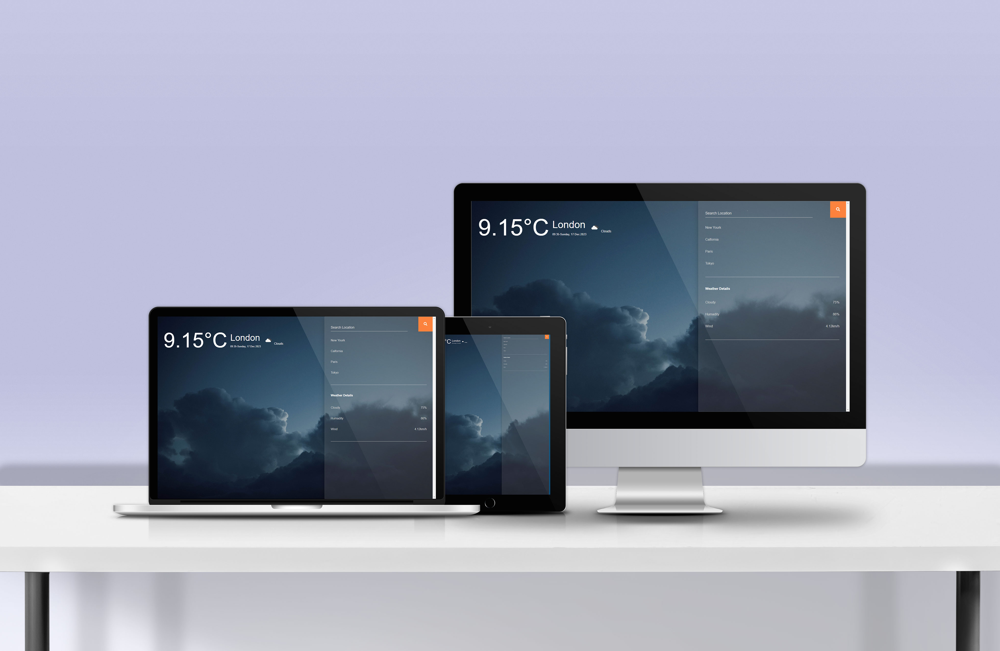
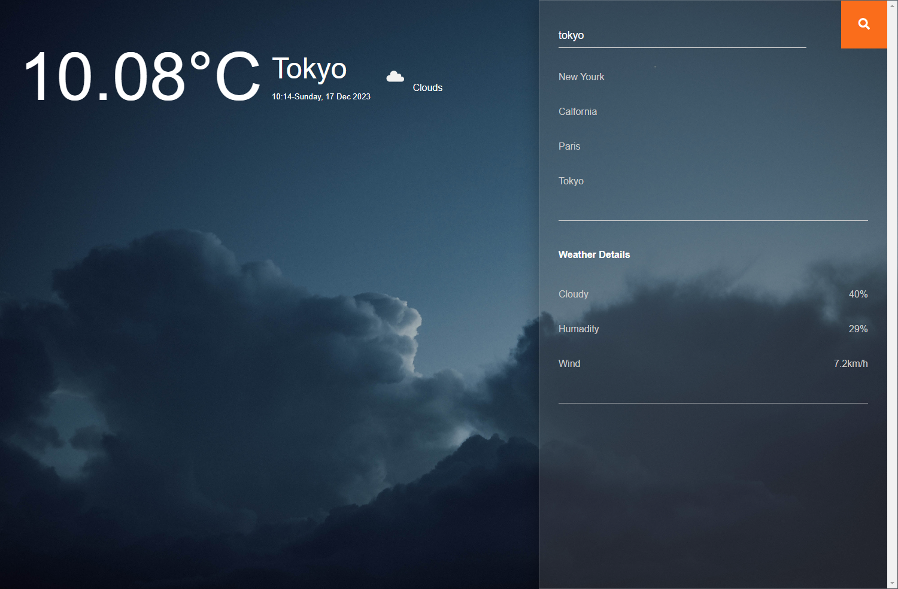
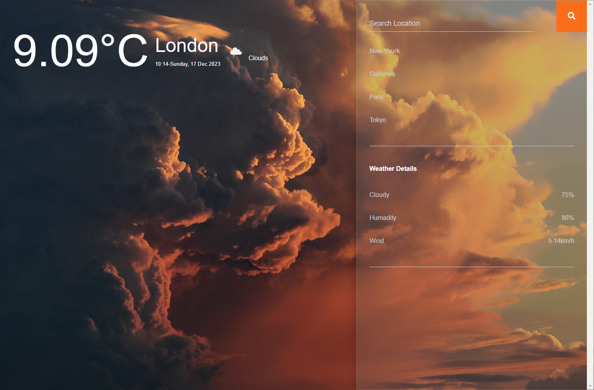
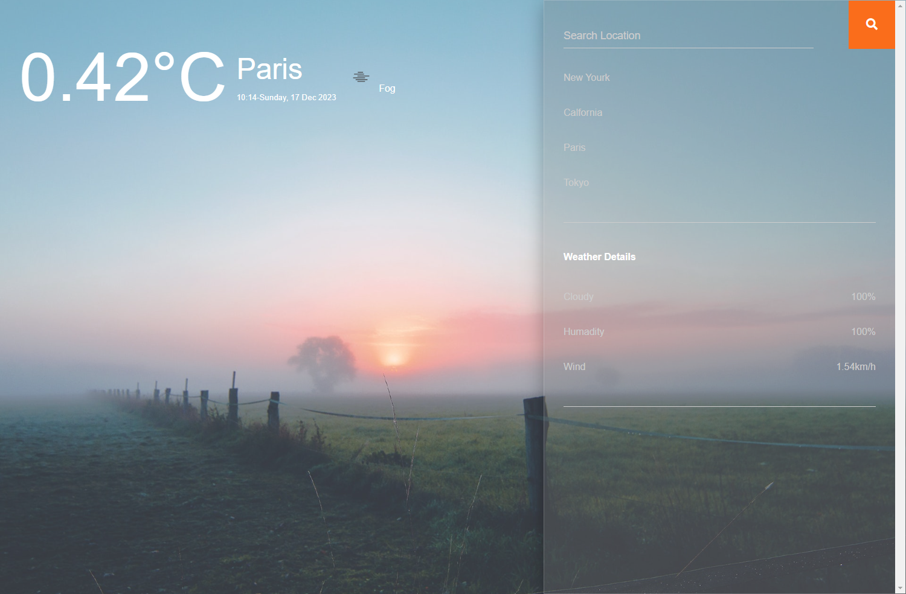
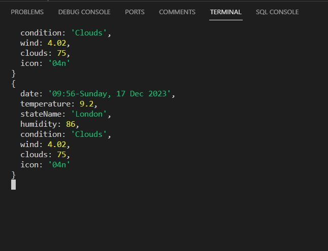

# Weather-Journal App Project 🌦

## Overview

Create an interactive web app that utilizes asynchronous communication with Web APIs and user data to dynamically update the user interface. This project focuses on building a weather journal application that provides real-time weather information based on user input.

## Features

- **Dynamic UI Updates**: The app dynamically updates the user interface based on the city, time, and current weather conditions ☁.

- **Time-Sensitive UI**: Depending on whether it's day or night, the UI adapts to provide a visually appropriate experience. For example, if it's raining at night, the UI will reflect this with corresponding icons and styles 🌫.

- **Weather Icons**: The application includes weather icons 🌤

## Instructions

Follow the steps outlined in the project to modify the `server.js` and `website/app.js` files. Refer to `index.html` for element references, and once you complete the project steps, use `style.css` to customize the appearance of your application 📅.

## Creadits

Weather app project is the second project in the Professional Front-End Web Development Nanodegree Program provided by Udacity

## Author

Name: Hossam Ayman
